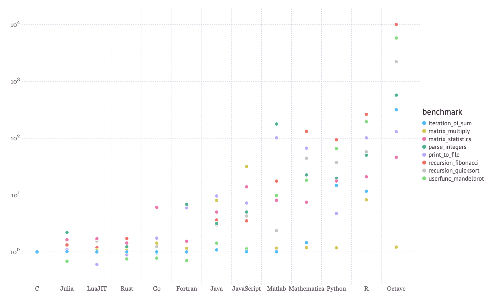
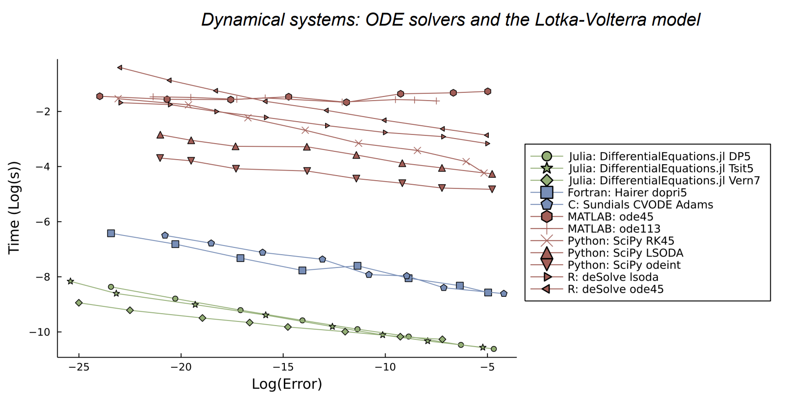
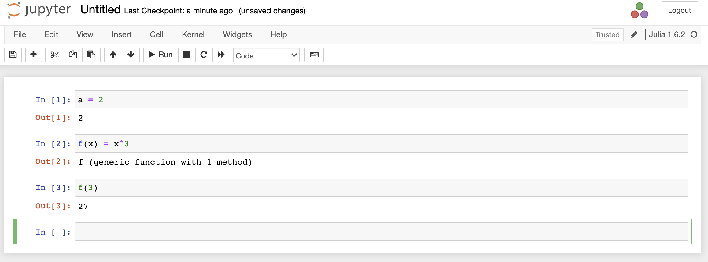
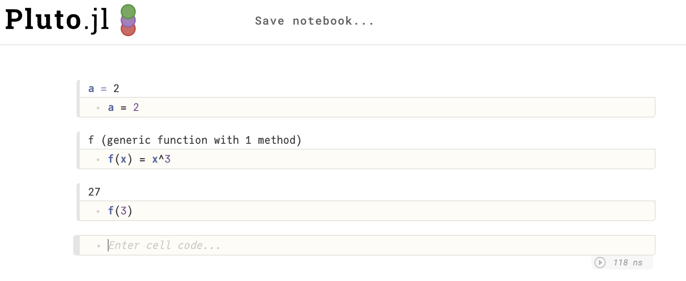
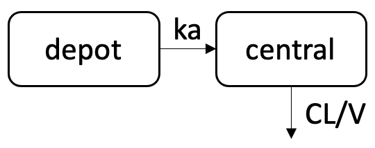
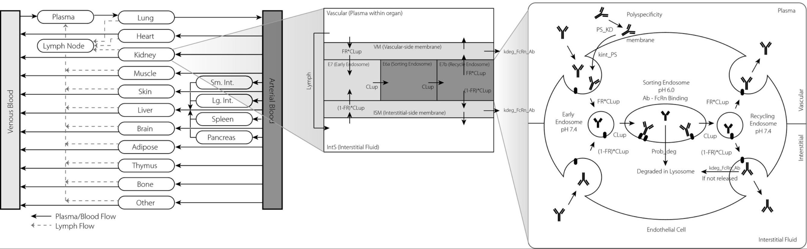

# A case-study driven introduction to the Julia language for R programmers

## Table of contents

  - [What is Julia?](#what-is-julia)
  - [History](#history)
  - [Why Julia?](#why-julia)
  - [Where does Julia need improvement?](#where-does-julia-need-improvement)
  - [Julia basics](#julia-basics)
    - [Environment](#environment)
    - [REPL modes](#repl-modes)
    - [Syntax](#syntax)
    - [Data structures](#data-structures)
  - [Control flow](#control-flow)
    - [Loops](#loops)
    - [Conditionals](#conditionals)
  - [Functions](#functions)
  - [Metaprogramming](#metaprogramming)
  - [Resources](#resources)
  - [Case studies](#case-studies)
    - [Theophylline one compartment PK model.](#theophylline-one-compartment-pk-model)
      - [Data wrangling](#data-wrangling)
      - [Exploratory data analysis](#exploratory-data-analysis)
      - [Sensitivity analysis](#sensitivity-analysis)
      - [Modeling and simulation](#modeling-and-simulation)
      - [Parameter estimation](#parameter-estimation)
    - [Monoclonal antibody PBPK model https://github.com/metrumresearchgroup/bioPBPK.](#monoclonal-antibody-pbpk-model-httpsgithubcommetrumresearchgroupbiopbpk)

---
## What is Julia?


An general-purpose, open-source programing language built for scientific computing.

https://julialang.org/

---

## History

Timeline:

- 2009 is when it all started with a group at MIT:
    - Alan Edelman
    - Viral Shah
    - Jeff Bezanson
    - Stefan Karpinski
- Development went on from 2009 till the launch in 2012
- Julia 1.0 release in 2018
- Now over 10,000 organizations are using Julia with over than 20 million downloads


https://github.com/rinpharma/2020_presentations/blob/main/talks_folder/2020-Shah-Julia_in_Pharma.pdf

---

## Why Julia?

- Attempts to solve the two-language problem - combines performance and expressiveness.

<font size="1">https://julialang.org/benchmarks/</font>

<font size="1">Roesch et al. (2021) https://arxiv.org/pdf/2109.09973.pdf</font>

- Ecosystem (> 6000 packages).

---

## Where does Julia need improvement?

- JIT compilation - "First time to plot" issue.
- Documentation.
- Ecosystem stability
- Developer tooling

---

## Julia basics

### Environment
- REPL (Rconsole)
- Script `.jl` (`.R`)
- IDE - vscode (Rstudio)
- Notebook: Jupyter, Pluto (R notebook)


- Markdown `.jmd` (`.Rmd`)

### REPL modes
- julia
- Help `?`
- Shell `;`
    - `pwd`
    - `cd`
    - `ls`
- Pkg `]`
    - `activate`
    - `add`
    - `rm`
    - `status`
    - `instantiate`

### Syntax
- Math `+` , `-` , `*` , `/` , `^` 
- Assign `=`
- Strings `""`
- Logical `==` , `>` , `<` , `>=` , `<=` , `&&` , `||` , `!=`
- Indexing
- Unicode symbols  https://docs.julialang.org/en/v1/manual/unicode-input/
- Types

### Data structures
- Tuple
- Dictionary
- Array
- Dataframe

## Control flow

No `{ }` to delimit, rather uses `end` for control flow

### Loops

- while loop
    ```julia
    n = 0
    while n < 10
        n = n + 1
        println(n)
    end
    ```
- for loop
    ```julia
    for i in 1:10
        println(i)
    end

    [i for i in 1:10]  # array comprehension
    ``` 

### Conditionals
- if else statement
    ```julia
    if a == 1
        println("a is equal to 1")
    else 
        println("a is not equal to 1")
    end
    ```

## Functions
```julia
function f1(x)
    return x*2
end

f2(x) = x*2
```

Multiple outputs
```julia
function f3(x)
    return x*2, x*3
end

f4(x) = x*2, x*3
```

Multiple dispatch
```julia
g(x::String) = "my name is $x"
g(x::Int64) = x*3
```

## Metaprogramming
Macros
```julia
@time 2*3
@show +
```

---

## Resources

Julia language: https://julialang.org/learning/

Discourse channel: https://discourse.julialang.org/

Slack channel: https://julialang.org/slack/

Noteworthy differences from R: https://docs.julialang.org/en/v1/manual/noteworthy-differences/#:~:text=For%20users%20coming%20to%20Julia,character%20vectors%20before%20creating%20substrings.

Intro to Julia Tutorial: https://www.youtube.com/watch?v=8h8rQyEpiZA&t=1765s

JuliaHub: https://juliahub.com/ui/Home

Packages:

A non-exhaustive sampling of packages to check out

- Data wrangling
    - CSV https://github.com/JuliaData/CSV.jl
    - DataFrames https://github.com/JuliaData/DataFrames.jl https://dataframes.juliadata.org/stable/man/comparisons/
    - DataFramesMeta https://juliadata.github.io/DataFramesMeta.jl/stable/
    - Chain https://github.com/jkrumbiegel/Chain.jl
    - Queryverse https://github.com/queryverse/Queryverse.jl
    - RDatasets https://github.com/JuliaStats/RDatasets.jl
    - CategoricalArrays https://categoricalarrays.juliadata.org/stable/
- Plotting
    - Plots https://github.com/JuliaPlots/Plots.jl
    - Gadfly https://github.com/GiovineItalia/Gadfly.jl
    - VegaLite https://github.com/queryverse/VegaLite.jl
    - StatsPlots https://github.com/JuliaPlots/StatsPlots.jl
- Modeling (SciML https://sciml.ai/)
    - DifferentialEquations https://diffeq.sciml.ai/dev/ (benchmarking https://sciml.ai/news/2021/05/24/QNDF/)
    - ModelingToolkit  https://mtk.sciml.ai/stable/
    - DiffEqSensitivity  https://github.com/SciML/DiffEqSensitivity.jl
    - GlobalSensitivity  https://github.com/SciML/GlobalSensitivity.jl
    - DiffEqParamEstim  https://diffeq.sciml.ai/latest/analysis/parameter_estimation/
    - GalacticOptim  https://galacticoptim.sciml.ai/stable/
- Bayesian inference
    - Turing https://turing.ml/stable/
    - MCMCChains https://turinglang.github.io/MCMCChains.jl/stable/
- Optimizers
    - Optim https://julianlsolvers.github.io/Optim.jl/stable/
    - BlackBoxOptim https://github.com/robertfeldt/BlackBoxOptim.jl
- Statistics
    - Statistics https://github.com/JuliaLang/Statistics.jl
    - Distributions https://juliastats.org/Distributions.jl/stable/
- Miscellaneous
    - LinearAlgebra https://docs.julialang.org/en/v1/stdlib/LinearAlgebra/
    - Random https://docs.julialang.org/en/v1/stdlib/Random/
    - RCall https://juliainterop.github.io/RCall.jl/stable/

---

## Case studies

### Theophylline one compartment PK model.
    
#### Data wrangling
- Built-in dataset in R https://stat.ethz.ch/R-manual/R-devel/library/datasets/html/Theoph.html where 12 subjects were given single oral doses of theophylline and plasma samples were collected to measure the levels of theophylline.

#### Exploratory data analysis
- Statistics
- Plots

#### Sensitivity analysis
- Local
- Global

#### Modeling and simulation
- A one compartment PK model with linear clearance will be built to fit theophylline PK data then simulations will be run using the optimized PK parameters (ka, CL, V).

- A previous theophylline model was fit using NONMEM https://ascpt.onlinelibrary.wiley.com/doi/pdf/10.1002/psp4.12404 and the estimates were ka = 1.46 /h ; CL = 2.88 L/h ; V = 33.01 L.



$$\frac{ddepot}{dt}=-k_a*depot$$
$$\frac{dcent}{dt}=k_a*depot-(\frac{CL}{V})*cent$$

#### Parameter estimation
- Point estimates
- Bayesian inference

$$p(θ|y)=\frac{p(y|θ).p(θ)}{p(y)}$$

- Hierarchical model

$$y_{ij}\sim \mathcal{N}(μ̂_{ij}, σ)$$
$$μ̂_{ij}=f_{1cpt}(t_{ij}, D_i, WT_i, θ_i)$$
$$θ_i=[ka_i,CL_i,V_i]$$
$$CL_i=ĈL*(\frac{WT_i}{70})^{0.75}$$
$$V_i=V̂*(\frac{WT_i}{70})$$
$$ka_i=k̂a*e^{ω_{ka}.η_i}$$

Priors:
$$σ ∼ Cauchy(0, 0.5)$$
$$k̂a \sim LogNormal(log(2.0), 0.2)$$
$$ĈL \sim LogNormal(log(4.0), 0.2)$$
$$V̂ \sim LogNormal(log(35.0), 0.2)$$
$$ω_{ka} ∼ Cauchy(0, 0.5)$$
$$η_i ∼ \mathcal{N}(0,1)$$

### Monoclonal antibody PBPK model https://github.com/metrumresearchgroup/bioPBPK.


<font size="1">Jones et al. (2019) https://doi.org/10.1002/psp4.12461</font>


